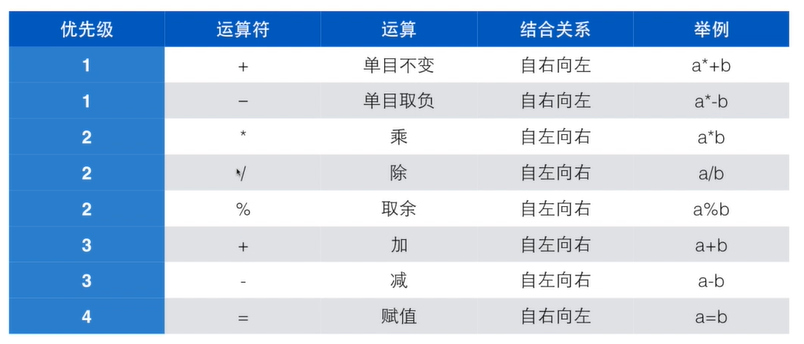
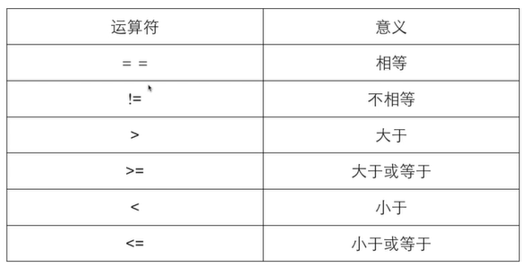
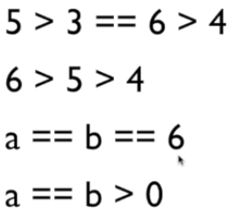

gcc
vim
<!-- TOC -->

- [程序设计与C语言](#程序设计与c语言)
    - [变量](#变量)
    - [数据类型](#数据类型)
- [计算](#计算)
    - [表达式](#表达式)
    - [运算符优先级](#运算符优先级)
    - [交换两个变量](#交换两个变量)
    - [复合赋值 和 递增递减运算符](#复合赋值-和-递增递减运算符)
- [判断与循环](#判断与循环)
    - [if else](#if-else)
    - [条件](#条件)
    - [注释](#注释)
    - [流程图](#流程图)
    - [循环](#循环)
    - [逻辑运算](#逻辑运算)
        - [优先级](#优先级)
        - [逻辑运算的短路](#逻辑运算的短路)
        - [条件运算](#条件运算)
        - [逗号运算符](#逗号运算符)

<!-- /TOC -->

## 程序设计与C语言
### 变量
%d
变量<类型名称><变量名称-标识符>
```
int price;
int 
```
标识符：字母数字下划线，不能数字开头，不能是关键字（不需要记）

赋值和初始化
（a=b在数学中表示关系，在程序设计中表示动作赋值）
变量在定义时候赋值叫做初始化，C中所有变量在第一次使用前应该被赋一次值
初始化：<类型名称><变量名称>=<初始值>
使用未初始化的变量：未初始化的变量会指向任意内存地址而出现一个任意的内存值，导致计算错误
```
int price=100;
int amount=10;

//or
int price=100, amount=10;
```

- 表达式

- 变量类型

- scanf和printf 函数:
scan format 
print format
```
int price;
scanf("%d",&price) //注意这个&
// 出现在scanf的字符都得输入进去才可以正常scan

```


- 常量:
```
const int AMOUNT=100;

```

### 数据类型
- 两个整数的运算结果只能是整数（小数点部分直接扔掉了floor） `10/3*3`在C中得9
- 10和10.0是完全不同得两个数字

整型 int
单精度浮点数 float
双精度浮点数 double
```
scanf("%lf %lf",&doubleNum,&floatNum)

// %lf %f
```

## 计算

### 表达式
一个表达式是一系列运算符和算子的组合，用来计算一个值
```
total=57;
count=count+1;
```
- 运算符`operator`:指运算的动作
```
四则运算 + - * /
取余 %
```
- 算子`operand`:指参与运算的值

计算时间差：

### 运算符优先级

单目加减，如取负、取正
赋值运算符`=`，优先级别最低，自右向左
不要做（”嵌入式赋值“:运算在括号中又进行赋值） int a=1+(b=a);（可读性差，容易错）

### 交换两个变量
```
// a=5  b-6  
// 使用中间变量做交换
int t;
t=a;
a=b;
b=t;
```
> 学习一些套路，很多东西有一些一般的做法，也是需要学习的。

### 复合赋值 和 递增递减运算符
- 复合赋值运算符
```
+=
-=
*=
/=
```
- 递增递减运算符
```
++
--

int tmp=++a // 加了再赋值
int tmp=a++ // 赋值了再++
```
> 不要自作聪明组合出非常复杂的运算表达式

## 判断与循环
 
### if else

### 条件

- 结果为整数 0 or 1
- 优先级比算术运算优先级低，比赋值运算优先级高
- `==`和`!=`比其他关系运算优先级更低,连续关系运算符的从左到右算


### 注释
//

/* */

### 流程图

> 写代码，有时候是能不能让足够多的人读懂你的代码

### 循环
`do whle`
`while`
`for`
- 计算一个数字的位数
```
int count( int x){
    if(x==0){
        return 1;
    }
    int n=0;
    while(x>0){
        x/=10;
        n++;
    }
    return n;
}

int count( int x){    
    int n=0;
    do{
        x/=10;
        n++;
    }
    while(x>0);
    return n;
}
```
> 注意测试边界情况
循环的选择

c99 编译`-std=c99`

多重循环
跳出多重循环
`多重break` `goto`(只在跳出多重循环时候使用，其他时候不要使用)

循环应用：
`sum`
`求最大公约数` 枚举 辗转相除法 欧几里得算法`Euclidean algorithm`

正序 逆序输出数字

`%` `循环` 计算数字位数 边界条件 0 700 1


### 逻辑运算
`!` `&&` `||`

```
//表示 4<x<6
c>4 && C<6

```


#### 优先级
`()` > `!` > `&&` > `||`

#### 逻辑运算的短路
对于`&&` 左边是false就不会进行右边了
对于`||` 左边是true就不会进行右边了

#### 条件运算 
`? :`
尽量只做简单条件判断，不做嵌套

#### 逗号运算符
一般只在赋值使用
```
int a=1,b=2
```

n


