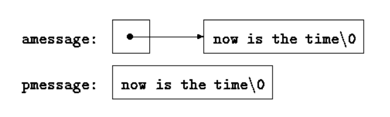

## 第二章 类型、运算符与表达式
### 2.8 自增运算符与自减运算符
- 前缀 ++ --
- 后缀 ++ --
前缀 ++ -- 会在执行赋值表达式之前进行自增或自减
```
int n=5;
int x=++n;          
//x > 6,  n > 6
```
后缀 ++ -- 会在执行赋值表达式之前进行自增或自减
```
if (c == '\n') {
    s[i++] = c; 
}

# 等同于

if (c == '\n') { 
 s[i] = c; 
 ++i; 
}  

while ((s[i++] = t[j++]){
    ...
}

# 等同于

while ((s = t){
    s++;
    t++;
}
```
### 2.10 赋值运算与表达式
```
while ((c = getchar()) !=EOF)
```
在所有的这类表达式中，赋值表达式的类型是它的左操作数的类型，其值是赋值操作完
成后的值

### 2.12 运算符优先级与求值次序
- [C Operator Precedence](http://www.enseignement.polytechnique.fr/informatique/INF478/docs/Cpp/en/c/language/operator_precedence.html)

在任何一种编程语言中，如果代码的执行结果与求值顺序相关，则都是不好的程序设计
风格。很自然，有必要了解哪些问题需要避免，但是，如果不知道这些问题在各种机器上是如何解决的，就最好不要尝试运用某种特殊的实现方式。

## 第五章 指针与数组
### 5.3 指针与数组
通过数组下标所能完成的任何操作都可以通过指针来实现。一般来说，用指针编写的程序比用数组下标编写的程序执行速度快，但另一方面，用指针实现的程序理解起来稍微困难一些。

理解指针与数组
```
int a[10];       # 声明一个10个元素的数组
                 # 实际上定义了10个对象组成的集合，这10个对象存储在相邻的内存区域中，名字分别为a[0]、a[1]...a[9]
                 # a[i]表示该数组的第i个元素

int *pa;         # 申明了一个指向整型对象的指针
pa=&a[0];        # 将指针pa指向了数组a的第0个元素（的内存地址）

int x= *pa;       # 将数组a[0]的内容复制到了变量x中
                
                 # 由于pa指向了数组的第0个元素（的内存地址），而数组中元素在内存中又是相邻存储的
                 # 所以pa+1指向了数组的第一个元素(的内存地址)
                 # 同样的pa+i指向了数组的第i个元素（的内存地址）
                 # *(pa+1)引用的是a[1]的内容，*(pa+i)引用a[i]的内容       
                 # 取数组长度
                 # int a[17];
                 # int n = (int)sizeof(a)/sizeof(a[0]); 
                 # 该表达式不能写成函数，只能写成宏（因为数组作为参数传递的是指针，其return的值则是指针的size）

# 正确的使用姿势： 
#define GETLEN(x)  (sizeof(x) / sizeof((x)[0]))

```
数组下标与指针
>**数组名所代表的就是该数组最开始的一个元素的地址**
```
pa=&a[0];       # 根据定义，数组类型的变量或表达式的值
                # 是该数组第 0 个元素的地址
                # 即a指向a[0]元素（的内存地址）
                # 所以上操作后， pa和a具有相同的地址，
                # 所以赋值操作也可以写成：
pa=a;                
                # 对于数组元素a[i]的引用也可以写成*(a+i)
                # 而且实际上使用a[i]时，C语言会先将其转换为*(a+i)再进行求值
                # 相应地，如果 pa 是个指针，那么，在表达式中也可以在它的后面加下标。 
                # pa[i]与*(pa+i)是等价的。
                
                # 另，注意&a 、a 、&a[0] 的区别
                # a指向了a[0]的地址，和&a[0]是等价的
                # 而&a指向了数组的首地址
                # &a 、a 、&a[0]三者地址等价，但是
                # &a+1 ！= （a+1） == （&a[1]）
                # a+1和&a[1]都是：首地址+sizeof(数组元素类型)
                # 而&a+1： 首地址+数组长度*sizeof(数组元素类型)

                # 结论：a 和 &a[0]可以用，&a慎重用（最好别用）

# 数组名和指针之间有一个不同之处，指针是一个变量，数组名是一个内存地址
# 因此，在 C语言中，语句 pa=a 和 pa++都是合法的。
# 但数组名不是变量，因此，类似于 a=pa 和 a++形式的语句是非法的

# 当把数组名传递给一个函数时，实际上传递的是该数组第一个元索的地址。在被调用函数中，该参数是一个局部变量，
# 因此，数组名参数必须是一个指针，也就是一个存储地址值的变量。
```
### 5.4 地址算术运算
+
-
比较

### 5.5 字符指针与函数
**字符串常量**是一个字符数组，例如："I am a string"
在字符串的内部表示中，字符数组以空字符'\0'结尾。所以，程序可以通过检查空字符找到字符数组的结尾。字符串常量占据的存储单元数也因此比双引号内的字符数大 1。

字符串常量最常见的用法也许是作为函数参数，例如：
princf("hello, world\n"}; 

另一种是和指针相关的：
```
char *pmessage;
pmessage="now is the time";       

# 这个操作会把一个指向该字符串数组（字符串常量）
# 的指针赋值给pmessage指针
```
关于字符串的标准库`<string.h>`

**两种定义字符串的方式**：
```
char amessage[] = "nw is the time"; /* 定义一个数组 */ 
char *pmessage = "now is the time"; /* 定义一个指针。指向一个字符串常量 */ 

上述声明中，
amessage 是一个仅仅足以存放初始化字符串以及空字符'\0'的一维数组。
数组中的单个字符可以进行修改，但 amessage 始终指向同一个存储位置。

另一方面，pmessage是一个指针，其初值指向一个字符串常量，
之后它可以被修改以指向其它地址，
但如果试图修改字符串的内容，结果是没有定义的

思考：字符串常量可以修改吗？ 不可以
"hello world"
这是一个表达式，其值是一个内存地址，程序运行时，就会分配一块内存空间来存储，内容是个常量，（程序生命周期中）不可被更改。
而数组字符串参考数组的定义，是一样的，每一个字符是数组的一个成员

# 数组字符串，只能在初始化时候定义，不可重新赋值，但可以修改数组成员（每个字符为一个成员）
# 字符串常量，可以重新赋值，不可修改（字符串常量中个某个字符，因为其整体是个常量）

一般的
如果需要对字符中的某个字符进行修改，且要用指针去操作
则是先定义一个字符串数组，再用一个指针指向它：

char a[]="hellow pointer";
char *p=a  or char *p=&a[0]    # 根据数组名的定义，这两种操作是等价的
```

**strcpoy**
```
/* strcpy: copy t to s*/ 
void strcpy(char *s, char *t) {
    while(*s++=*t++)
        ;
}
// useage
char s[]="sadasd";
chat t[]="zzadas";
strcpy(&s,&t)
```
**strcmp**
```
/* strcmp: 
    s<t, return <0
    s==t, return 0
    s>t, return >0
*/ 
void strcmp(char *s, char *t) {
    for(;*s==*t;s++,t++;){
        if(*s=="\0"){
            return 0;
        }        
    }
    return *s-*t
}
```
**进栈和出栈的标准用法**
```
*p++ = val; /* 将 val 压入栈 */ 
val = *--p; /* 将栈顶元素弹出到 val 中 */ 
```
### 5.6 指针数组以及指向指针的数组


```
# UNIX 程序 sort 的一个简化版本:
# 按字母顺序对由文本行组成的集合进行排序


```